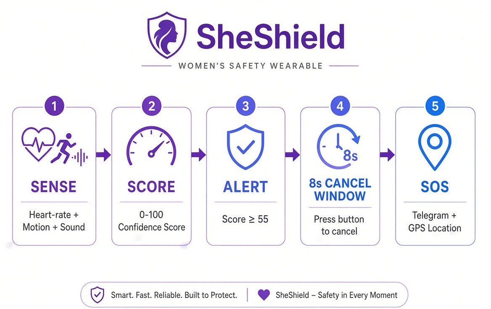
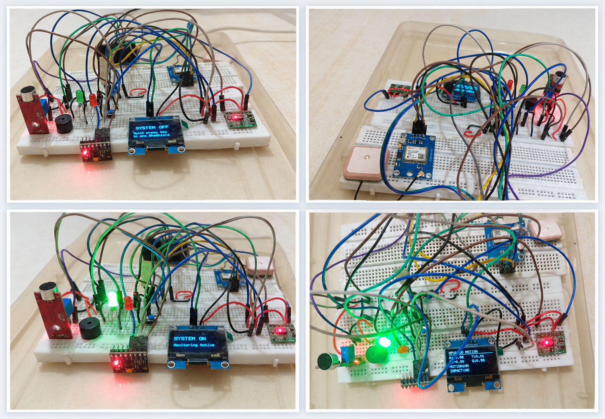
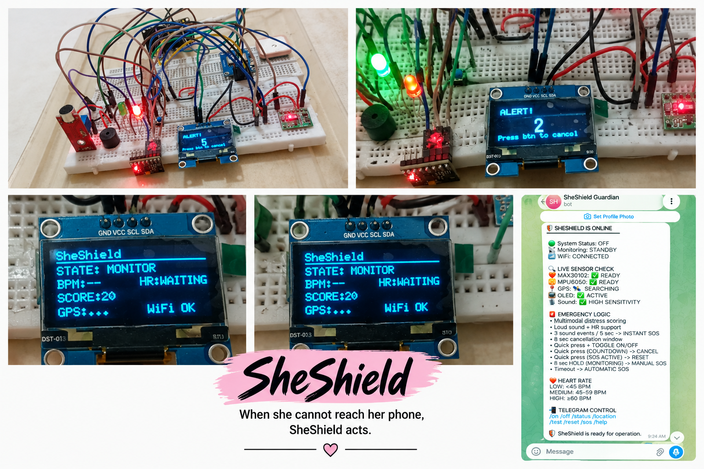
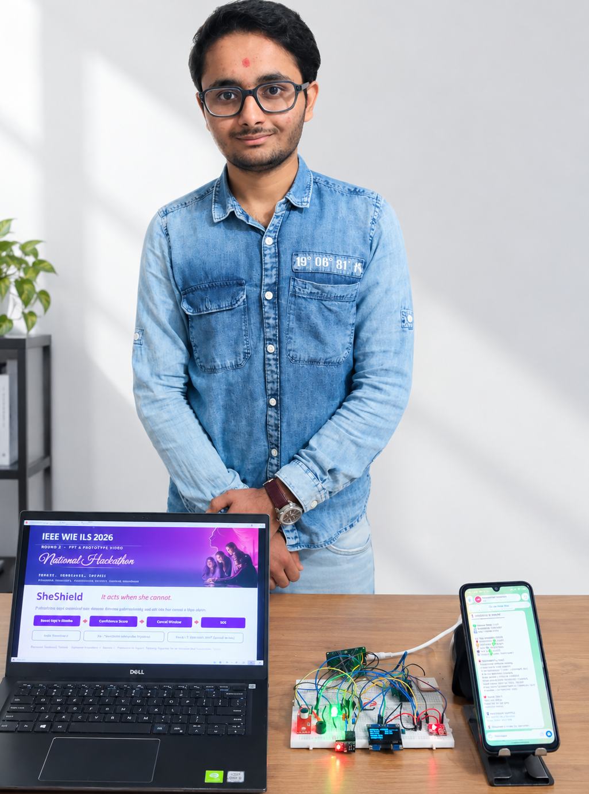

<div align="center">

# 🛡️ SheShield
### **When she cannot reach her phone, SheShield acts.**

**A multimodal wearable safety prototype that detects distress automatically — heart rate, sound, and motion working together — and escalates to SOS without needing a button press.**


</div>

---


---

## 🏆 Event

**IEEE WIE ILS 2026 — National Hackathon**
**Track 3 — SheLeads (WIE Special Track)**
**Problem Statement P6 — SheShield Wearable (Hybrid)**

---

## 🚨 The Problem

Most safety apps and devices assume one thing: **the user can act.**

```
📱 Reach Phone → 🔓 Unlock → 📲 Open App → 🔘 Press SOS → 🚨 Help
```

In a real emergency, that chain often breaks before it starts. The person may be:

- Physically restrained or unable to reach their phone
- In shock, unable to think clearly or act precisely
- In a situation where pulling out a phone escalates the danger

**SheShield is built for the gap traditional systems miss** — the moment before someone can even ask for help.

---

## 💡 Our Solution

SheShield is an **ESP32-based multimodal wearable** that continuously watches multiple physical signals and turns them into a single, explainable distress decision — no manual trigger required.

**Sense → Score → Warn → Allow Cancellation → Escalate**

| Signal | Sensor | Role |
|---|---|---|
| ❤️ Heart Rate | MAX30102 | Personal baseline + sudden HR rise |
| 🎙️ Sound | Sound Sensor | Soft-voice / distress sound events |
| 📳 Motion | MPU6050 | Sustained movement / struggle |
| 💥 Impact | MPU6050 | Sudden impact / fall-like event |
| 📍 Location | NEO-6M GPS | Real coordinates for the SOS alert |
| 📺 Feedback | SH1106 OLED | Local live system status |
| 🚨 Alert | Buzzer + LEDs | On-device emergency indication |
| 📲 Escalation | Wi-Fi + Telegram | Remote SOS with location |

No single sensor decides alone — signals combine into one **distress score**.



---

## 🧮 Explainable Distress Engine

Instead of an unexplained "AI says yes/no," the prototype exposes a visible, auditable score.

| Detected Signal | Score Contribution |
|---|---:|
| HR rise ≥ +15 BPM | +30 |
| HR rise ≥ +25 BPM | +60 (crosses threshold alone) |
| 1 soft-voice event | +20 |
| 2 soft-voice events | +40 |
| 3 soft-voice events | +60 (fires SOS instantly) |
| Sustained motion | +15 |
| Sudden impact / fall-like | +30 |

<div align="center">

### 🎯 Automatic Escalation Threshold: **55 / 100**

</div>

---

## 🛡️ Why It Won't Cry Wolf

Safety tech that triggers on every bump gets ignored — or turned off. SheShield is designed with multiple layers to prevent that:

1. **Multimodal context** — no single sensor decides alone; signals have to agree.
2. **Explainable scoring** — every contribution to the score can be inspected.
3. **8-second human-in-the-loop window** — a short button press cancels any automatic alert instantly.
4. **Manual override** — the wearer can always trigger SOS directly, bypassing the score entirely.
5. **Personal HR baseline** — adapts to the wearer instead of relying on one fixed universal BPM value.

```
🚨 DISTRESS DETECTED → 🎯 SCORE ≥ 55 → ⏳ 8s WINDOW
                                            │
                                  ┌─────────┴─────────┐
                              🔘 CANCEL           NO ACTION
                                  │                    │
                            🟢 CANCELLED            🚨 SOS
                                                        │
                                              ┌─────────┴─────────┐
                                          📲 TELEGRAM         📍 GPS
```

---

## 🔘 Physical Controls

| User Action | Result |
|---|---|
| Quick press — System OFF | 🟢 Turn ON |
| Quick press — Monitoring | 🔴 Turn OFF |
| Quick press — Countdown | 🛑 Cancel |
| Quick press — SOS Active | 🔄 Reset |
| Hold 8 seconds (Monitoring) | 🆘 Instant Manual SOS |
| Motion gesture — System OFF | 🟢 Arm device |

---

## 📲 Telegram Command Center

| Command | Function |
|---|---|
| `/start`, `/help` | Open command center |
| `/status` | Live sensor & system status |
| `/location` | GPS location + Google Maps link |
| `/test` | Hardware communication test |
| `/reset` | Reset emergency state |
| `/sos` | Trigger manual SOS |
| `/on` / `/off` | Arm / disarm system |

When GPS is valid, the SOS message includes latitude, longitude, satellite count, HDOP, a Google Maps link, and a live Telegram location pin.

---

## 📸 Hardware Prototype

<div align="center">






</div>

---

## 🔧 Hardware & Cost

| Component | Role | Approx. Cost |
|---|---|---:|
| ESP32 DevKit | Main controller | ₹300–450 |
| MAX30102 | Heart-rate sensing | ₹120–200 |
| MPU6050 | Motion / impact sensing | ₹80–130 |
| NEO-6M GPS | Location | ₹250–400 |
| Sound Sensor | Voice / sound events | ₹50–100 |
| SH1106 OLED (1.3") | Live status display | ₹150–200 |
| Buzzer + LEDs | Local alert | ₹50 |
| Push Button | Manual control | ₹10–25 |
| Breadboard, wires, case | Prototype build | ₹150–350 |
| **Total Prototype Cost** | | **≈ ₹900 – 1,400** |

### Pin Map

| Component | ESP32 Pin |
|---|---|
| MAX30102 / MPU6050 / OLED (I2C) | SDA 21, SCL 22 |
| GPS TX → | GPIO 4 (RX2) |
| GPS RX ← | GPIO 5 (TX2) |
| Sound Sensor | GPIO 34 |
| Buzzer | GPIO 26 |
| Red LED | GPIO 27 |
| Green LED | GPIO 25 |
| Button | GPIO 13 |

### Tech Stack

ESP32 · Arduino Framework · MAX30105/MAX30102 Library · MPU6050 (raw I2C) · TinyGPS++ · U8g2 · UniversalTelegramBot · Wi-Fi · Telegram Bot API

---

## 📁 Repository Structure

```
SheShield/
├── firmware/
│   └── SheShield.ino
├── hardware/
│   ├── wiring/
│   ├── circuit/
│   └── prototype-images/
├── docs/
│   ├── architecture/
│   ├── testing/
│   └── presentation/
├── demo/
│   └── demo-video-link.md
└── README.md
```

---

## 📈 Prototype Status vs Roadmap

### ✅ Working Today

Multimodal sensing · personal HR baseline · soft-voice detection · motion & impact detection · explainable distress score · 8-second cancellation · manual SOS · GPS acquisition · OLED interface · Telegram alerts & commands · local LED/buzzer feedback.

### 🚀 Roadmap

| Phase | Focus |
|---|---|
| **1 — Prototype** *(current)* | Multimodal sensing, scoring, GPS, Telegram, cancellation |
| **2 — Wearable Engineering** | Custom PCB, compact enclosure, jewellery/wrist form factor, better power management |
| **3 — Communication Independence** | GSM/LTE + SMS fallback so it doesn't depend on Wi-Fi |
| **4 — Intelligent Personalization** | Longer baseline, sensor fusion, adaptive thresholds, stronger false-alarm filtering |
| **5 — Validation** | Controlled testing across movement/voice scenarios, battery + human-factor testing |

---

## ⚠️ Honest Limitations

We'd rather be transparent than oversell a prototype:

- Sound sensing detects **intensity/events**, not speech — it does not recognize specific words.
- Telegram escalation currently needs Wi-Fi/internet; GSM/SMS fallback is on the roadmap.
- GPS needs satellite visibility and may not get an immediate fix indoors.
- Heart-rate accuracy depends on correct sensor contact.
- Thresholds are prototype values that need further real-world calibration.
- This is a research/hackathon prototype — **not** a certified medical or emergency-response device, and not a replacement for emergency authorities.

**Prototype ≠ Product.** The current goal is to validate the multimodal safety concept and emergency-response pipeline.

---

## 🔐 Security

**Never commit real credentials to GitHub.** Use placeholders in the firmware and keep actual values in a local, untracked config:

```cpp
#define BOT_TOKEN "YOUR_BOT_TOKEN"
#define CHAT_ID   "YOUR_CHAT_ID"

const char* WIFI_SSID     = "YOUR_WIFI";
const char* WIFI_PASSWORD = "YOUR_PASSWORD";
```

---

## 🎥 Demo

Recommended demo sequence: System OFF → ON → live monitoring → soft-voice detection → distress score → 8-second countdown → cancel → trigger again → SOS → Telegram alert → GPS location → manual SOS hold.

[▶https://drive.google.com/file/d/1BlsPJShyzV3eILE0zheHAcHvunwJRicK/view?usp=sharing)

---

## 👥 Team — SheShield

| Member | Role | Institution |
|---|---|---|
| **Harsh Parmar** | Team Lead · Hardware & Firmware | Marwadi University, Rajkot |
| **Mirali Sankaliya** | SOS Integration · Documentation | Atmiya University |

---

## 📜 License

Released under the **MIT License** — built for educational, research, and hackathon purposes.

<div align="center">

### 🛡️ Sense. Protect. Respond.

**Built as a student research prototype for IEEE WIE ILS 2026.**

</div>
